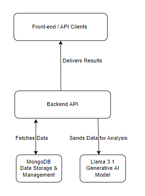

# Generative-Backend Pipeline Setup with Llama 3.1 and MongoDB

This guide outlines the setup of a generative-backend pipeline using Llama 3.1, which connects with MongoDB to feed data for the model to generate analytical insights.

## Table of Contents
- [Overview](#overview)
- [Architecture](#architecture)
- [Setup](#setup)
  - [Prerequisites](#prerequisites)
  - [MongoDB Setup](#mongodb-setup)
  - [Llama 3.1 Model Setup](#llama-31-model-setup)
  - [Backend Connectivity](#backend-connectivity)
  - [Analytical Data Flow](#analytical-data-flow)
- [Approach](#approach)
- [Key Methods](#key-methods)
- [References](#references)

## Overview

This pipeline allows MongoDB data to be fed directly into Llama 3.1, enabling the model to process and generate insightful analytical results. The pipeline is designed to automate the data ingestion, analysis, and response generation process, making it useful for data-driven decision-making systems.

## Architecture

1. MongoDB: Data storage and management.
2. Llama 3.1: Generative AI model that consumes data from MongoDB for analysis.
3. Backend API: Handles data requests and responses between MongoDB and Llama 3.1.
4. Front-end or API Clients: Consumes the generated analytical results for visualization or reporting.

 _[Placeholder for an architectural diagram]_

## Setup

### Prerequisites
- Python 3.8+
- MongoDB (Local or Atlas instance)
- Llama 3.1 model files
- Node.js (for backend service, if needed)
- Docker (optional but recommended for containerized deployment)

### MongoDB Setup

1. Install MongoDB:
   ```bash
   sudo apt install -y mongodb
   ```

2. Start MongoDB service:
   ```bash
   sudo service mongodb start
   ```

3. Create a new database:
   ```bash
   use analytics_db
   ```

4. Insert test data into the database:
   ```javascript
   db.analytics.insertMany([
     { "category": "sales", "value": 200, "date": "2023-09-21" },
     { "category": "marketing", "value": 150, "date": "2023-09-22" }
   ]);
   ```

### Llama 3.1 Model Setup

1. Download Llama 3.1:
   Obtain Llama 3.1 through Meta AI or another trusted source.

2. Set up the model:
   Install dependencies for running the model:
   ```bash
   pip install transformers torch
   ```

3. Load the model:
   Load the model in Python:
   ```python
   from transformers import LlamaTokenizer, LlamaForCausalLM

   tokenizer = LlamaTokenizer.from_pretrained("meta-llama/llama-3.1")
   model = LlamaForCausalLM.from_pretrained("meta-llama/llama-3.1")
   ```

4. Test the model with a basic prompt:
   ```python
   input_text = "What is the sales trend for the past month?"
   inputs = tokenizer(input_text, return_tensors="pt")
   outputs = model.generate(inputs)
   print(tokenizer.decode(outputs[0], skip_special_tokens=True))
   ```

### Backend Connectivity

1. Connect MongoDB with Backend:
   Using `pymongo` in Python:
   ```bash
   pip install pymongo
   ```

   Sample code to fetch data:
   ```python
   from pymongo import MongoClient

   client = MongoClient("mongodb://localhost:27017/")
   db = client["analytics_db"]
   collection = db["analytics"]

   data = collection.find({"category": "sales"})
   for doc in data:
       print(doc)
   ```

2. Process MongoDB Data with Llama 3.1:
   After fetching data, you can pass it into the Llama model:
   ```python
   query = "Analyze the sales data for trends:"
   data_to_analyze = [doc["value"] for doc in collection.find({"category": "sales"})]
   query += f" {data_to_analyze}"

   inputs = tokenizer(query, return_tensors="pt")
   outputs = model.generate(inputs)
   print(tokenizer.decode(outputs[0], skip_special_tokens=True))
   ```

### Analytical Data Flow

1. Data Ingestion: MongoDB stores data (e.g., sales, marketing, etc.).
2. Data Fetching: Backend service fetches data from MongoDB using queries.
3. Processing: The Llama model analyzes the data and generates insights.
4. Response: The analytical result is returned to the frontend for display.

## Approach

### 1. Data Collection & Management
   - MongoDB is used to collect and store the data.
   - The data can be structured or semi-structured, and the focus is on storing the relevant data required for the model's analytical processing.

### 2. Model Training / Fine-Tuning
   - Llama 3.1 is capable of analyzing large datasets.
   - Optionally, fine-tune Llama on the domain-specific data (e.g., financial data, sales data) to improve its performance for particular analytical tasks.

### 3. Model Inference
   - Feed MongoDB data to the model for inference.
   - This involves querying MongoDB, preprocessing the data if necessary, and feeding it into Llama 3.1 to get a generated analytical result.

### 4. Deployment
   - The backend can be containerized using Docker for easy deployment.
   - Scalable APIs can be built on top of this setup to handle multiple requests, handle large datasets, and return fast analytical responses.

## Key Methods

- MongoDB Queries: Use efficient queries to fetch the required data for analysis.
  Example: Aggregation queries for summarizing data.
  
- Llama Model Inference: Preprocess the MongoDB data and pass it as input to Llama for generating natural language analytical results.

- Fine-tuning Llama: (Optional) Use `transformers` library to fine-tune the Llama model on your domain-specific dataset.

## References

- [Llama 3.1 Documentation](https://huggingface.co/meta-llama)
- [MongoDB Documentation](https://www.mongodb.com/docs/)
- [Hugging Face Transformers](https://huggingface.co/docs/transformers/index)
